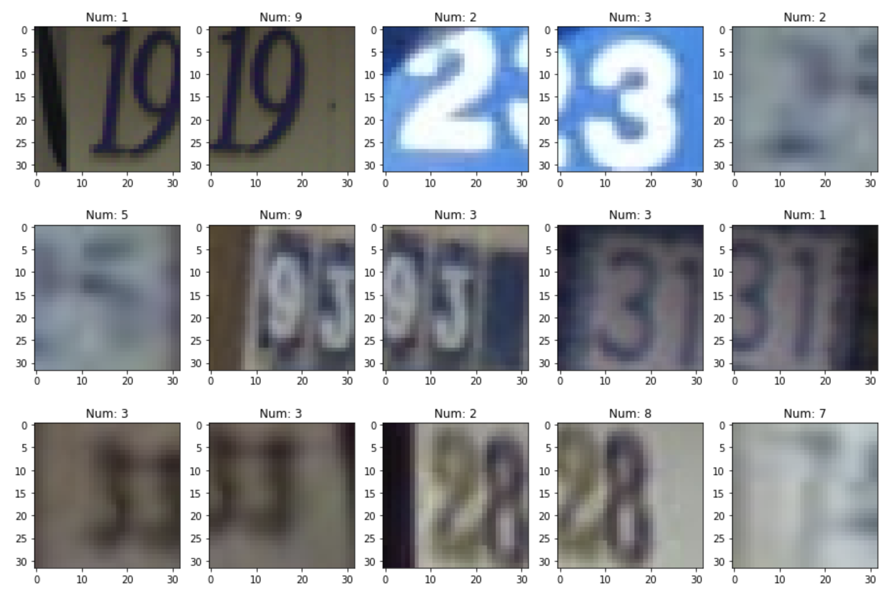

# Digit Recognizer Project Final Report

## Street View Digit Recognition

### Team Members
- Yunsong Liu, yliu3390
- Weilong Shen, wshen61
- Mingxiao Song, msong300
- Yukun Song, ysong442
- Sining Huang, shuang423

### Final Report Video
[Link To Video](https://youtu.be/Eyu2vRqIvVk)

### 1. Introduction/Background
Object detection and digit recognition has become the most fundamental but hottest topics in machine learning because of its creative potential in real world scenarios. It is thus necessary to create automated systems that can help read and categorize text and digit when necessary in order to get rid of simple but repetitive work needed to be done by human beings.

Although digit recognition itself is a basic task in computer vision, it is still an important step towards solving more complicated problems. There has been a variety of related works that use different machine learning methods such as simple PyTorch and neural networks to train the data but tend to be specialized to particular applications or even datasets. Thus, there is still the necessity to always optimize existing models for better results no matter how much research has been done to create a more packable and effective tool that can fulfill the needs of higher-level research. Innovation is endless as more work can always be done to improve the efficiency and accuracy of current models and employ the solution in real world situations.

### 2. Problem Definition
Our group choose the topic of Digit Recognition converting written digits and numbers into printed text. Beyond exploring the fundamental functionality, we add more complexity by training models with real world scenarios, specifically colored digit recognition in natural scene images.

The problem we want to solve is that we want to support digit recognition in natural scenes that can potentially be employed by real prducts. For example, nowadays, in most smartphones and tablets, there are applications available that convert handwritten characters and numbers into printed text, and this has proved to be very useful and convenient for those who prefer writing than typing on phones, especially some elder people that are not familiar with typing. We will be using multiple machine learning methods to model the training data, and select the one(s) that best models our training data and provides the most accurate outputs from our test data.

In this project, we focus on reading digits from house-number signs in street level images. Given labeled house number images, we will train multiple models with the training dataset and compare their results. Then we will test the model with more real world images each containing multiple colored digits and see if the model can successfully recognize those digits given more distractions. We believe that the model that has been trained with such real world dataset will be useful for other complicated digit and text recognition senarios as well.

### 3. Data Collection & Preprocessing
#### 3.1 Data Collection
We researched two popular digit recognition datasets: MNIST and SVHN.

The [MNIST](http://yann.lecun.com/exdb/mnist/) dataset contains handwritten digits that is most commonly used for training and testing for digit recognition models. It consists of gray-scale images of handwritten digits of size 28 * 28, for a total of 784 pixels. Each pixel value is an integer from 0 to 255, inclusive. The dataset is really powerful for training fundamental machine learning models, but regarding the goal of this project it seems too trivial and basic. Therefore, we improve our project and investigate another dataset, SVHN.

The [SVHN](http://ufldl.stanford.edu/housenumbers/) dataset is a real-world image dataset that is obtained from house numbers in Google Street View images, containing 73,257 digits for training, 26,032 digits for testing and 531,131 additional less difficult samples. The data is labeled with 10 classes: digit ‘1’ has label 1, ‘9’ has label 9 and ‘0’ has label 10. The dataset contains two formats: the original iamges with character level bounding boxes and MNIST-like 32-by-32 images centered around a single character. The first format is more similar to real world datasets and require as to preprocess the data and extract single digits from the images. The second format is also challenging as each image contains some distracting digits around the main digit of interest, therefore adding difficulty to our training.

For simplicity, we decided to use the second format from the SVHN dataset, applying different preprocessing techniques to get datasets for comparison and multi-dimensioned validation. We also plan to use the MNIST dataset when training complex models initially.

  
  

As you can see in the number distribution chart above, ‘1’ is the most common label in the SVHN dataset. This correponds with Benford’s Law, which says the leading digit is more likely to be small. However, this creates unexpected difficulty in clustering models.

#### 3.2 Data Preprocessing
We utlized Principle Component Analysis (PCA) algorithm for dimentionality reduction. PCA transforms a set of correlated variables into a smaller number of uncorrelated variables called principal components while keeping as much of the variability in the original data as possible. The retained variance was set to 0.99 for choosing principle components.
For a set of color image with size ), we worked in the following approaches:

&nbsp;&nbsp;1. **Separated Channels**: Transform image to size ) which retaining 3 RGB color channels

&nbsp;&nbsp;2. **Flattened Channels**: Transform image to size ) which flattening color channels
