# Digit Recognizer Project Final Report

## Street View Digit Recognition

### Team Members
- Yunsong Liu, yliu3390@gatech.edu
- Weilong Shen, wshen61@gatech.edu
- Mingxiao Song, msong300@gatech.edu
- Yukun Song, ysong442@gatech.edu
- Sining Huang, shuang423@gatech.edu

### Final Report Video
[Link To Video](https://youtu.be/Eyu2vRqIvVk)

### 1. Introduction/Background
Object detection and digit recognition has become the most fundamental but hottest topics in machine learning because of its creative potential in real world scenarios. It is thus necessary to create automated systems that can help read and categorize text and digit when necessary in order to get rid of simple but repetitive work needed to be done by human beings.

Although digit recognition itself is a basic task in computer vision, it is still an important step towards solving more complicated problems. There has been a variety of related works that use different machine learning methods such as simple PyTorch and neural networks to train the data but tend to be specialized to particular applications or even datasets. Thus, there is still the necessity to always optimize existing models for better results no matter how much research has been done to create a more packable and effective tool that can fulfill the needs of higher-level research. Innovation is endless as more work can always be done to improve the efficiency and accuracy of current models and employ the solution in real world situations.

### 2. Problem Definition
Our group choose the topic of Digit Recognition converting written digits and numbers into printed text. Beyond exploring the fundamental functionality, we add more complexity by training models with real world scenarios, specifically colored digit recognition in natural scene images.

The problem we want to solve is that we want to support digit recognition in natural scenes that can potentially be employed by real prducts. For example, nowadays, in most smartphones and tablets, there are applications available that convert handwritten characters and numbers into printed text, and this has proved to be very useful and convenient for those who prefer writing than typing on phones, especially some elder people that are not familiar with typing. We will be using multiple machine learning methods to model the training data, and select the one(s) that best models our training data and provides the most accurate outputs from our test data.

In this project, we focus on reading digits from house-number signs in street level images. Given labeled house number images, we will train multiple models with the training dataset and compare their results. Then we will test the model with more real world images each containing multiple colored digits and see if the model can successfully recognize those digits given more distractions. We believe that the model that has been trained with such real world dataset will be useful for other complicated digit and text recognition senarios as well.

### 3. Data Collection & Preprocessing
#### 3.1 Data Collection
We researched two popular digit recognition datasets: MNIST and SVHN.

The [MNIST](http://yann.lecun.com/exdb/mnist/) dataset contains handwritten digits that is most commonly used for training and testing for digit recognition models. It consists of gray-scale images of handwritten digits of size 28 * 28, for a total of 784 pixels. Each pixel value is an integer from 0 to 255, inclusive. The dataset is really powerful for training fundamental machine learning models, but regarding the goal of this project it seems too trivial and basic. Therefore, we improve our project and investigate another dataset, SVHN.

The [SVHN](http://ufldl.stanford.edu/housenumbers/) dataset is a real-world image dataset that is obtained from house numbers in Google Street View images, containing 73,257 digits for training, 26,032 digits for testing and 531,131 additional less difficult samples. The data is labeled with 10 classes: digit ‘1’ has label 1, ‘9’ has label 9 and ‘0’ has label 10. The dataset contains two formats: the original iamges with character level bounding boxes and MNIST-like 32-by-32 images centered around a single character. The first format is more similar to real world datasets and require as to preprocess the data and extract single digits from the images. The second format is also challenging as each image contains some distracting digits around the main digit of interest, therefore adding difficulty to our training.

For simplicity, we decided to use the second format from the SVHN dataset, applying different preprocessing techniques to get datasets for comparison and multi-dimensioned validation. We also plan to use the MNIST dataset when training complex models initially.

  
  

As you can see in the number distribution chart above, ‘1’ is the most common label in the SVHN dataset. This correponds with Benford’s Law, which says the leading digit is more likely to be small. However, this creates unexpected difficulty in clustering models.

#### 3.2 Data Preprocessing
We utlized Principle Component Analysis (PCA) algorithm for dimentionality reduction. PCA transforms a set of correlated variables into a smaller number of uncorrelated variables called principal components while keeping as much of the variability in the original data as possible. The retained variance was set to 0.99 for choosing principle components.
For a set of color image with size ), we worked in the following approaches:

&nbsp;&nbsp;&nbsp;&nbsp;1. **Separated Channels**: Transform image to size ) which retaining 3 RGB color channels  
&nbsp;&nbsp;&nbsp;&nbsp;2. **Flattened Channels**: Transform image to size ) which flattening color channels

#### 3.3 Data Preprocessing Results

We selected 200 images from the SVHN dataset and completed PCA. The results for separated channels and flattened channels are listed below:

Separated Channels (R, G, B)

  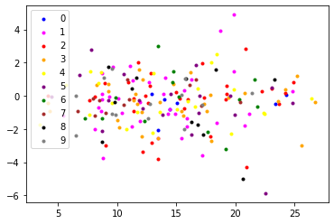
  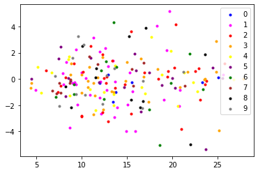  
  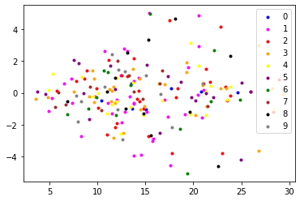

Flattened Channels

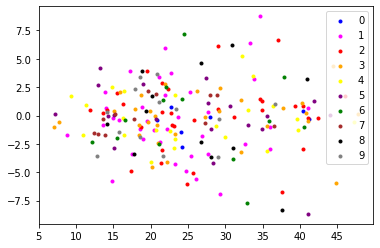

Due to the large number of independent features in the dataset, the principal components are difficult to interpret the important features. Therefore, the classification performance is relatively weak.

### 4. Models

#### 4.1 K-Means

It was initially puzzling how we can apply K-Means, an unsupervised learning method, to our problem at hand. After reading a few examples on performing K-Means on MNIST digit classification, we found the approach quite straightforward.

The idea is to divide our dataset into clusters either by using a pixel as a feature or by using features selected by PCA. Because there are 1024 pixels in each color channel, there would be a total of 3072 features if we are to run K Means without preprocessing. Compared to a dataset preprocessed with PCA, it would take K Means significantly more time to compute new cluster centers without preprocessing. With further evaluation, we have found that the original dataset without preprocessing also results in a worse performance accuracy-wise.

With the dataset divided into clusters, each data point would be assigned a cluster label. For each cluster, we would compare it with true labels (0-9) and pick one label that this cluster best represents. For example, if a cluster has 5 data points whose true labels are [1, 1, 3, 8, 9], 1 would best represent this cluster. We would then mark all data points within a cluster with the most representative true label for this cluster. Then we can compare these predictions with true labels to get an accuracy score.

To improve accuracy, we can specify a higher number of clusters. This works because different digit ‘7’s may exist far apart in the domain space. Thus, telling K-Means to divide our dataset into 10 clusters would result very badly. However, we need to keep in mind that a higher number of clusters could also lead to overfitting.

  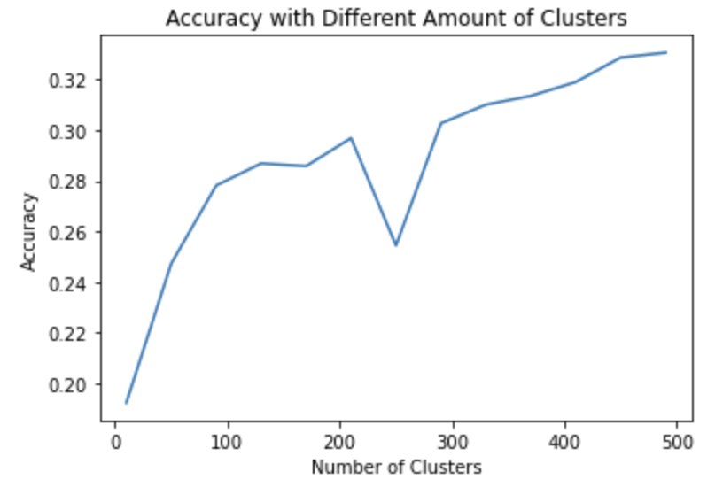

The result from K Means is not very promising. The accuracy is only 0.28 with K-Means dividing the dataset preprocessed by PCA into 130 clusters. As we attempted different settings for the model by changing the number of clusters, there is not a significant increase in the accuracy value. As seen in the graph, accuracy plateaus at about 0.35 with 500 clusters. This forms a sharp contrast with K-Means’s performance with MNIST, on which it can reach an accuracy of 0.89 with 256 clusters. One explanation for the poor performance of K-Means is that images in the SVHN are too complex to be handled by it. Complex backgrounds and distracting numbers make the domain space of images much larger than that of images from MNIST.

#### 4.2 Random Forest

We employed the random forest model to train the digit image dataset. Random forest model is an ensemble learning method for classification, regression and other tasks that operates by constructing a multitude of decision trees at training time. For classification tasks, the output of the random forest is the class selected by most trees. Given the data with size of N * pixel * pixel * 3 channels, falttening data into N * D to fit in random forest is necessary. We assumed converting 3 color channels to 1 color channel has little impact on training; therefore we converted by taking average of three channels. Here are some examples of combined colored images:

  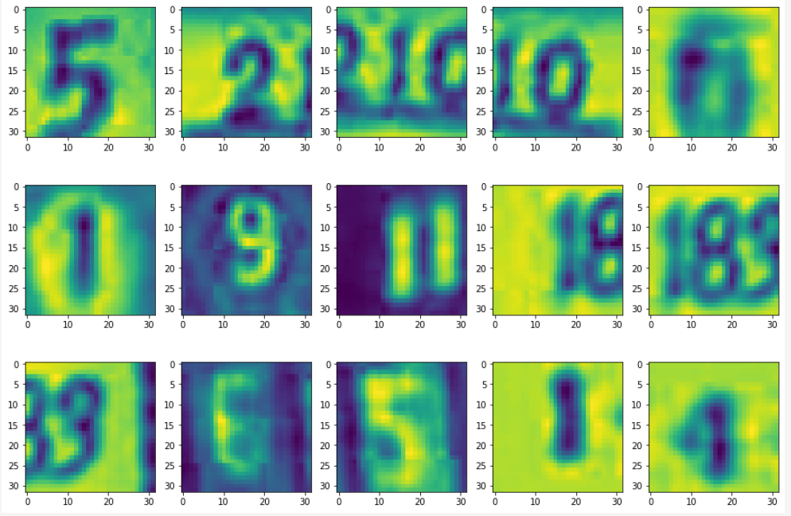

Each pixel in an image represents one feature in the random forest. Therefore, we flattened the pixel part of the dataset by converting N * pixels * pixels into size of N * D, where D represents size of pixels * pixels. This is the data preprocessing part.

Then, we consider choosing the parameters for the random forest: maximum features (between 0 to 1) and maximum depth. Since each pixel represents one feature in the random forest model, it is supposed that only pixels that includes the digit can be regarded as “important” features. According to the dataset, the size of the digit is roughly 40% that of the entire picture. As we expected, the testing accuracy is the highest when max_feature equals 0.4.

  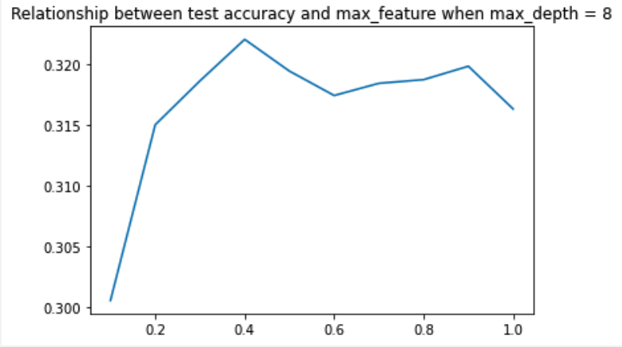

Therefore, we set max_feature to 0.4 and trained the model with different maximum depths to determine which depth is the most suitable for the training data to reduce both overfitting and underfitting. According to the output test accuracy, the maximum depth should be 18.

  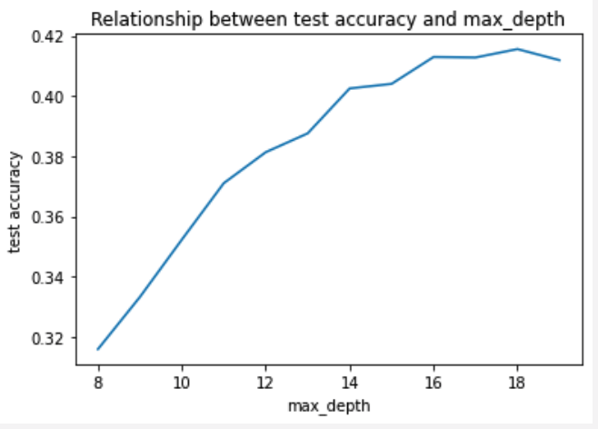

With parameters maximum depth = 18 and maximum features = 0.4, the test accuracy is around 41%. The error may be caused by overfitting in training dataset, which leads to prediction error during testing. Additionally, it is difficult for the random forest model to choose the most important features because a pixel in an image could be very important while, in another image, the pixel at the same position could be much less important, and vice versa.

#### 4.3 Support Vector Machine

We then experimented with SVM on our dataset. Our implementation is done through Scikit Learn’s C-Support Vector Classification(SVC) package. We experimented with both SVC with PCA and SVC without PCA.

Due to the time cost of training SVC models, we initially trained a SVC model with only 3000 records from the complete training set with more than 70,000 records. First, we compared SVC with PCA and SVC without PCA. We selected the best hyperparameters for each by grid searching. Two critical hyperparameters to be tuned are C and Gamma. C determines how much error to be tolerated. A high C typically helps reduce variance. Gamma determines how much curvature the decision boundary has. A low gamma helps reduce variance as well.

With PCA, the best accuracy achieved in a testing set of 1000 records is 0.60 (C = 10, gamma = 10). However, keeping 50 principal components led to a similar accuracy of 0.59. Also, the number of principal components kept influences accuracy massively. Keeping more principal components actually lowers accuracy. For instance, using PCA with n_component = 150 results in an accuracy of 0.41 (C = 5, gamma = 0.01). The figure below on the left is the statistics of SVC model without PCA trained on 3000 records. On the right is the statistics of SVC model with PCA (n_component = 50) trained with 3000 records. Both are tested on 1000 records.

  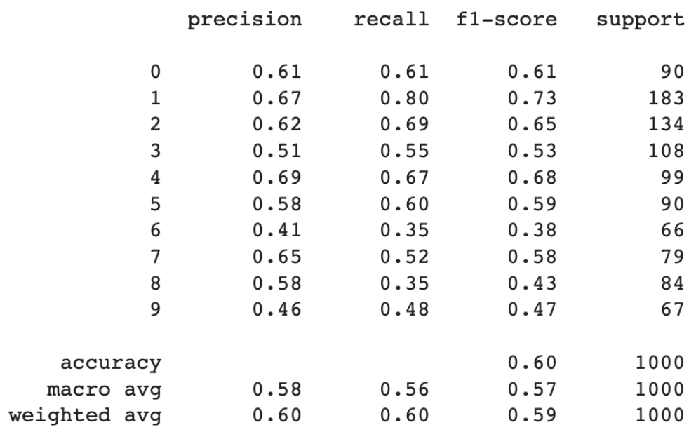
  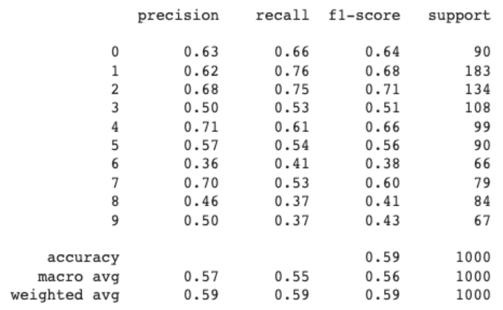

Since using PCA is much more time-efficient, we moved on with SVC with PCA. Next, we tried to fit a model with setting to larger training datasets. We increased the size of training datasets to 6,000 rows and testing datasets to 3,000 rows. This increases accuracy to 0.65. We then increased the training set size to 10,000 rows, which is said to be the recommended maximum training sample size for Scikit Learn’s SVC. The result was quite positive with an accuracy of 0.68. The tuned hyperparameter value are C = 50, gamma = 0.01. As you can see, C is very large, and gamma is very small here, which corresponds with a high accuracy in testing dataset. The figure below on the left is the statistics of SVC model with PCA trained on 6000 records and tested on 3,000 records. On the right is the statistics of SVC model with PCA trained with 10,000 records and tested on 4,000 records.

  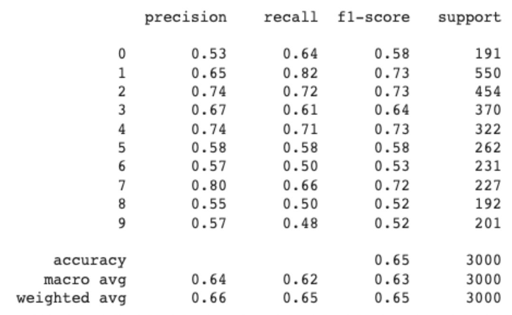
  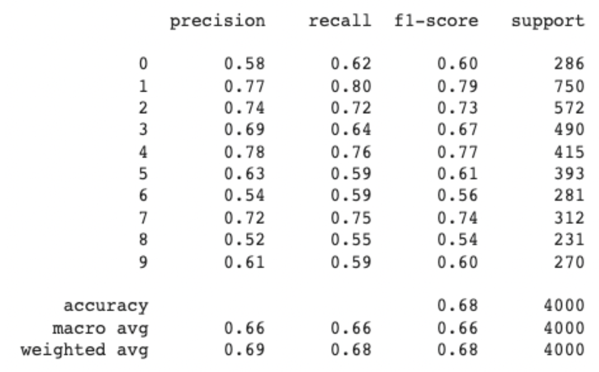

#### 4.4 Convolutional Neural Network

#### 4.4.1 LeNet

The first CNN that we train, test, and analyze is LeNet. It is proposed by Yann LeCun who developed the MNIST digit recognizer dataset. In the nutshell, LeNet contains three Conv2D layers using Rectified Linear Unit (ReLU) as the activation function, as well as two AvgPool2D layers. It is especially good at recognizing digits and characters. Through implementing it and testing it on the original MNIST dataset, we can reach a validation accuracy of 99.04% under optimal hyperparameters. It was also reported that running LeNet on the kMNIST dataset (which contains Japanese characters rather than digits) yields a testing accuracy of over 95%. In this project, we will use LeNet to train the more complex SVHN dataset and report the highest accuracy that it can reach on optimal hyperparameters.

One important limitation of LeNet is that, being designed for the grayscale MNIST dataset, the network only takes in 32 by 32 grayscale images containing digits just like MNIST. Therefore, before running LeNet, we first transform all images in the training and test datasets from 3-channel RGB images into 1-channel grayscale images. The image below shows one of the images in the test dataset after being transformed into grayscale.

  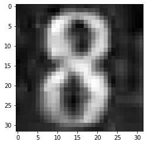

Using the optimal hyperparameters obtained from previous runs on the MNIST dataset, we start a preliminary trial of running the network on the SVHN training dataset (73,257 images), and the resulting accuracy is around 86%, which is not as good as we expect. We further studied the training dataset, and we discovered not only an increased complexity of the dataset but also distracting factors due to cropping digits from the original images taken from real numbers on the houses. For example, below are two images from the training dataset. They are cropped from the same image, and they are basically the same showing both 1 and 9, but the one on the left has label 1 while the one on the right has label 9.

  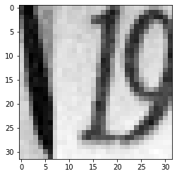
  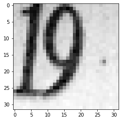

We later decided to add (much) more training data and use the extra training dataset (531,131 images) to train the model so that we can by a large extent reduce the influence of distracting digits. Training a dataset 7 times as big as the original one obviously increases the runtime of training the model to around 10 minutes, but this is not something that we cannot accept. By running the extra training dataset, the model’s testing accuracy reaches around 90%.

Next, we tune the hyperparameters and try to find an optimal set that maximizes the validation accuracy. To reduce the amount of time used to train the network while tuning the network, we only train the network using the first 100,000 images, and train only 5 epochs when tuning the learning rate and the batch size.

The first hyperparameter being tuned is the learning rate. We set the batch size to 128 and train 5 epochs using different learning rates ranging from 0.0001 to 0.1. We plot the testing loss after 5 epochs against the learning rate, and the figures are as follows.

  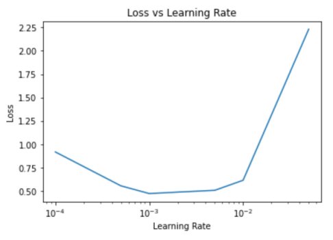
  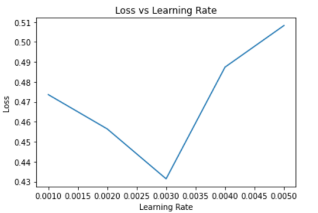

The figure on the left shows the overall trend. We note that the best learning rate is around 0.001, so we zoom in this area, as shown in the figure on the right. We pick the learning rate with the least loss, which is 0.003.

The second hyperparameter being tuned is the batch size. We set the learning rate to 0.003 and train 5 epochs using different batch sizes from 32 to 256. Again, we plot loss against it.

  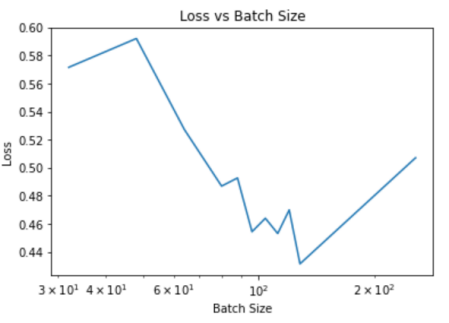

Note that there are fluctuations in the graph due to random initialization, but we find batch size around 100-130 to yield the least loss. Since most processing units have storage capacity in power of two, batch size is best to be a power of 2. Therefore, we pick batch size 128.

The third hyperparameter being tuned is the number of epochs. We set the learning rate to 0.003 and batch size to 128 and train the model only one time for 15 epochs, recording the training and testing loss after each epoch and plot them.

  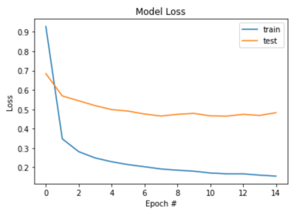

We can see that each training epoch reduces training loss, but the testing loss started to plateau in epochs between 7 and 12, and starts to increase after due to possible overfitting. We therefore pick 10 as the optimal number of epochs so that the model can both learn the pattern and, at the same time, avoid overfitting.

Using learning rate 0.003 and batch size 128, we train the model for 10 epochs on all 531,131 images in the extra dataset. The resulting model has training loss 0.11 and testing loss 0.30, and it is able to predict 23,983 correctly out of 26,032 images in the test dataset, yielding accuracy 92.13%.

The model’s confusion matrix on testing data and its precision, recall, and f1-score metrics are as follows.

  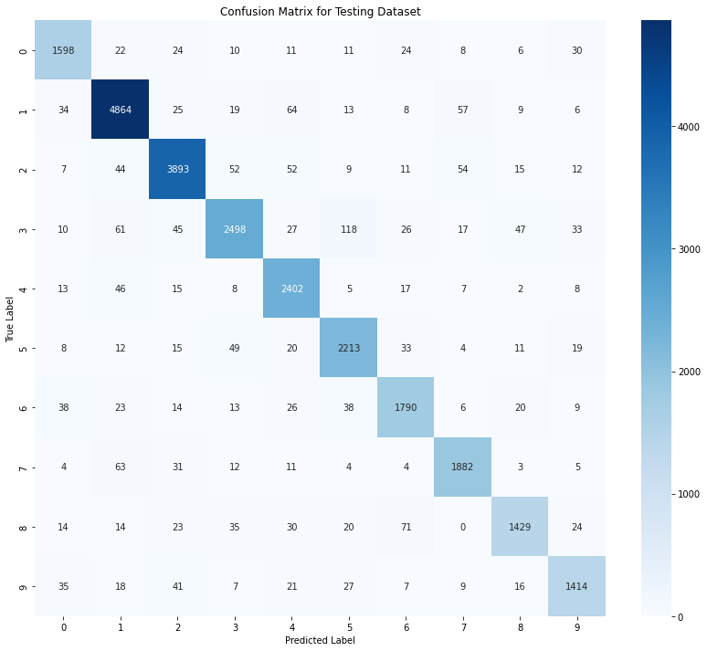
  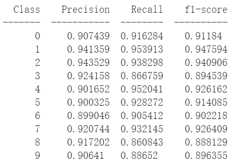

#### 4.4.2 Self-defined CNN

LeNet is designed for MNIST, a much simpler dataset than SVHN. It has a lot of limitations, for example 1) it contains too few layers to handle the relatively high complexity in the SVHN dataset, and 2) it only takes in grayscale images, which forces us to convert 3-channel images in SVHN to grayscale before training it.

Therefore, we continue our analysis of CNN using another CNN model that are designed specifically for the SVHN dataset. It consists of more layers of Conv2D and, instead of AvgPool2D, MaxPool2D. To deploy the learning potential of this CNN model, we use data augmentation techniques to preprocess the data before training. There are two reasons for the data augmentation process: 1) although our dataset is already big enough, increasing the number of images can help raise the amount of most relevant data in the dataset, helping the model learn the most relevant features. Secondly, there might be limitations on the variations of the dataset and since real world target applications may exist in a variety of conditions, we should account for such situations by training the model also with dataset with larger variations. The main approaches we use are rotation, scaling and shifting.

Before we start training the model, we first run experiments to determine the best learning rate by increasing the learning rate gradually throughout 10 epochs of training. Given the following result, we observe a pattern in the learning rate and loss diagram, specifically the loss falling down dramatically initially but gradually stabilizing in an interval. Therefore, we choose the learning rate of 0.01 that corresponds to the most stabilized loss region.

  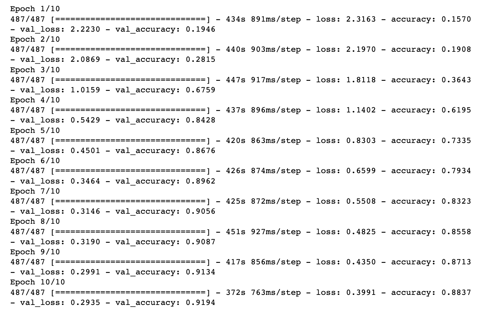
  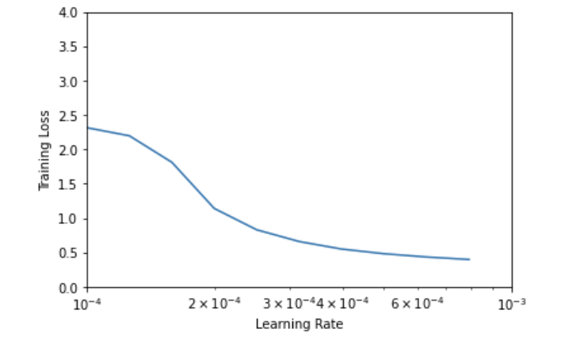 

Given these assumptions, we run this CNN model with a learning rate of 0.01 and the Adam optimizer on a combination of Conv2D and MaxPool2D layers for 9 epochs. The graph below traces out the convergent trend of the learning accuracy and loss in both our training and validation sets, as the accuracy of both gradually converges to 0.94.

  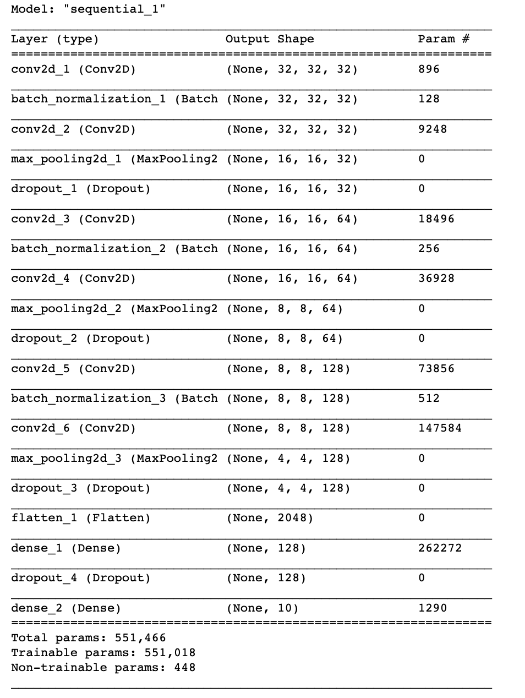
  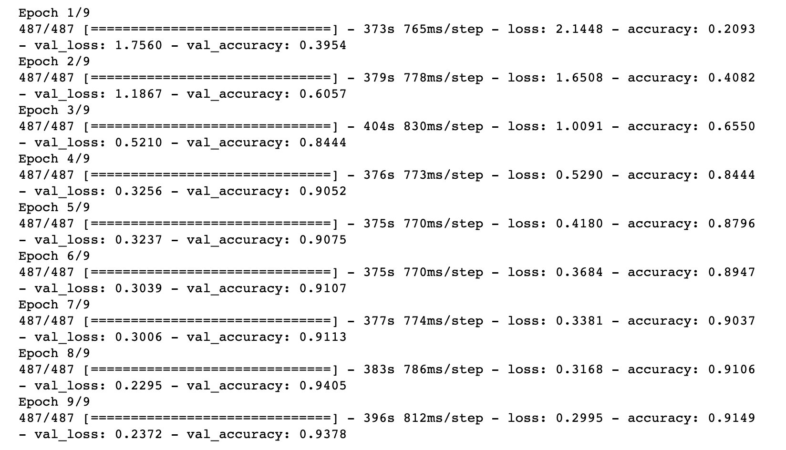 

  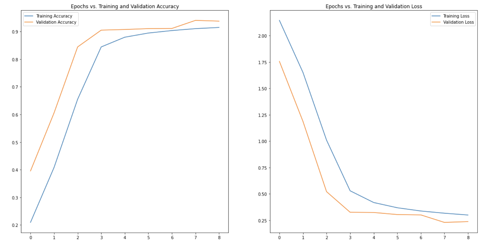

The confusion matrix below clearly shows the correlation between the actual label and predicted ones together with a classification report for the precision, recall and f1-score for each class.

  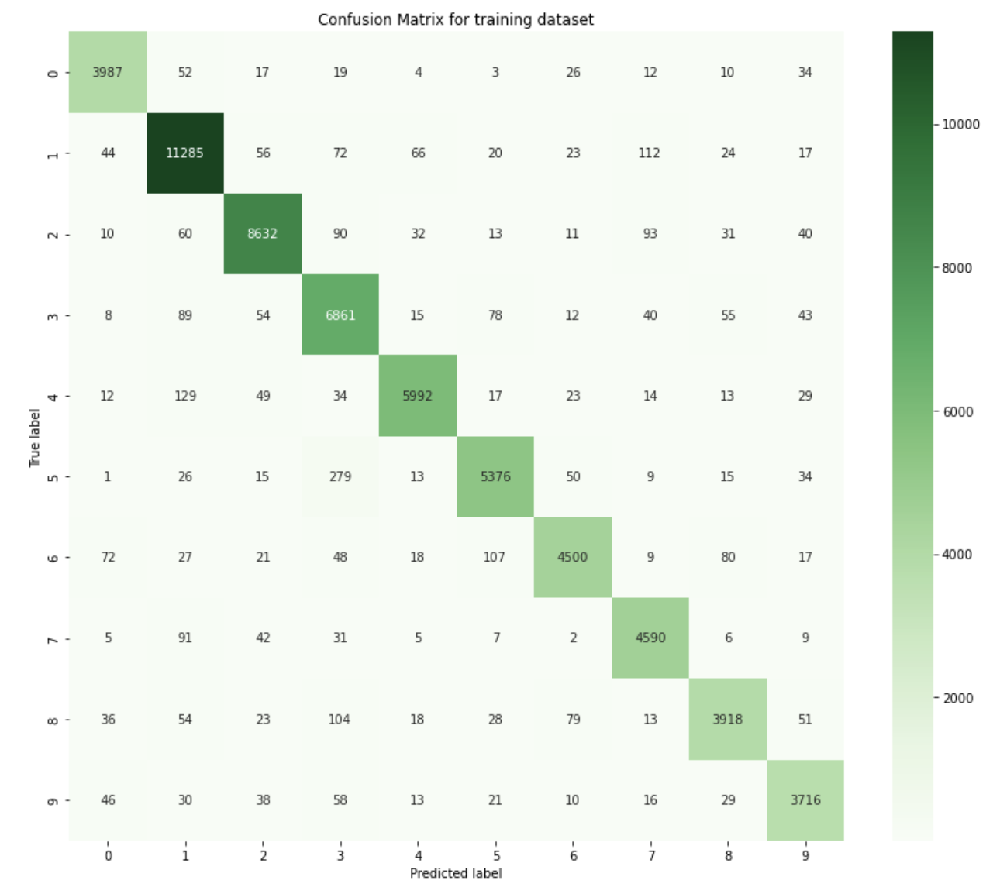
  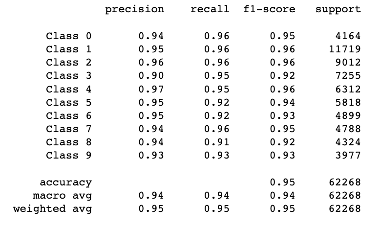

We also draw the feature maps for a particular image and visualize how the model learns features layer by layer. The main idea behind these graphs is that the CNN model learns deeper features when it goes into more layers. After a several layers, we cannot understand the high level features the model is learning intuitively, but that’s also why such neural network is powerful for tasks such as digit recognition because it can learn features hard to be spotted by human beings.

  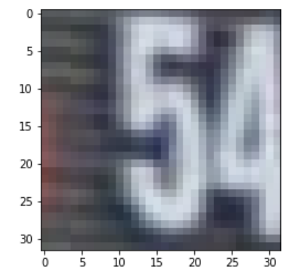
  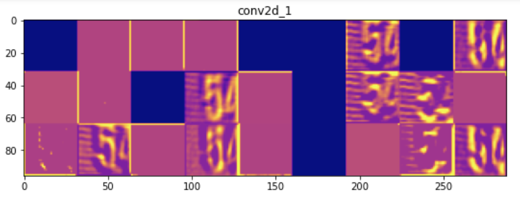
  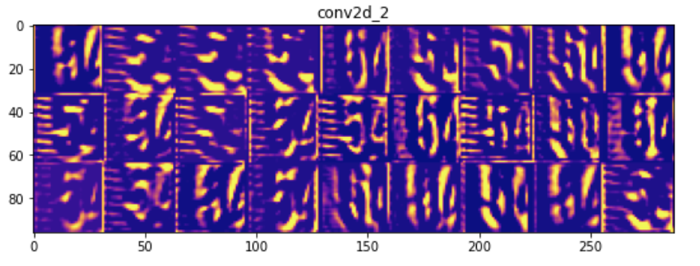 
  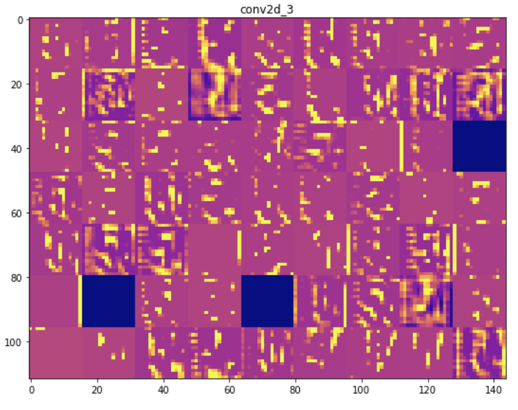 
  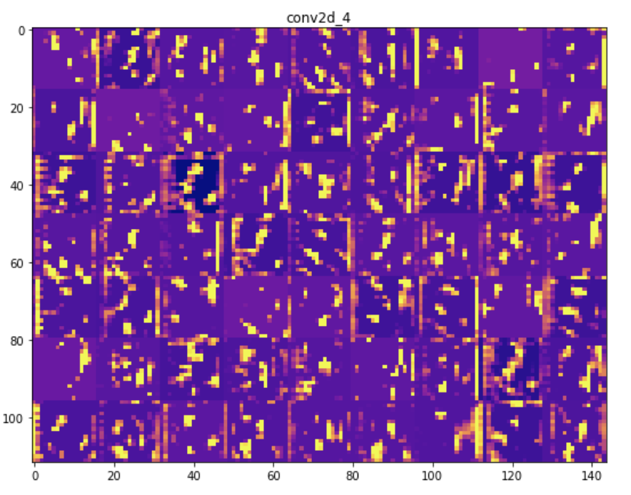 

Finally, running the model with our test dataset we get a test accuracy of 94.15% and test loss of 0.2264, which is a good indication that this CNN model performs well on the SVHN dataset.

Noted that for CNN models, we didn’t use the preprocessed dataset with PCA since the linear transformation performed by PCA can be performed just as well by the input layer weights of the neural network.

### 5. Conclusion

With our combined analysis using both unsupervised and supervised algorithms, we get the following results:

  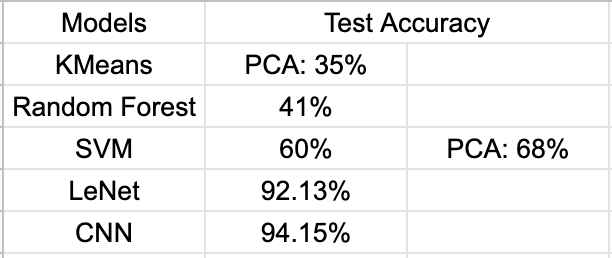

As you can see, the best results are achieved by using LeNet and the CNN we designed, indicating that neural network is highly favored by our image dataset. Simple models such as K-Means, random forest and even SVM do not perform as well with our complicated image dataset given many hidden features to be discovered. Though keeping finding better hyperparameters for these models may lead to better results, it still may not outperform deep learning models such as CNN. We also find that PCA does not improve the efficiency of our models a lot. In conclusion, neural networks seem to be the best models we can use for digit recognition in real scenarios. Theoretically, it can be explained by its ability to discover and construct complex features through layers of hidden neurons and weights. Therefore, for future steps, we plan to do more research in deep learning models and employ pretrained transfer learning models to increase training efficiency.

### References

&nbsp;&nbsp;&nbsp;&nbsp;1. M. Jain, G. Kaur, M. P. Quamar and H. Gupta, “Handwritten Digit Recognition Using CNN,” 2021 International Conference on Innovative Practices in Technology and Management (ICIPTM), 2021, pp. 211-215, doi: 10.1109/ICIPTM52218.2021.9388351.  
&nbsp;&nbsp;&nbsp;&nbsp;1. Netzer, Yuval & Wang, Tao & Coates, Adam & Bissacco, Alessandro & Wu, Bo & Ng, Andrew. (2011). Reading Digits in Natural Images with Unsupervised Feature Learning. NIPS.  
&nbsp;&nbsp;&nbsp;&nbsp;1. Goodfellow, Ian & Bulatov, Yaroslav & Ibarz, Julian & Arnoud, Sacha & Shet, Vinay. (2013). Multi-digit Number Recognition from Street View Imagery using Deep Convolutional Neural Networks.
